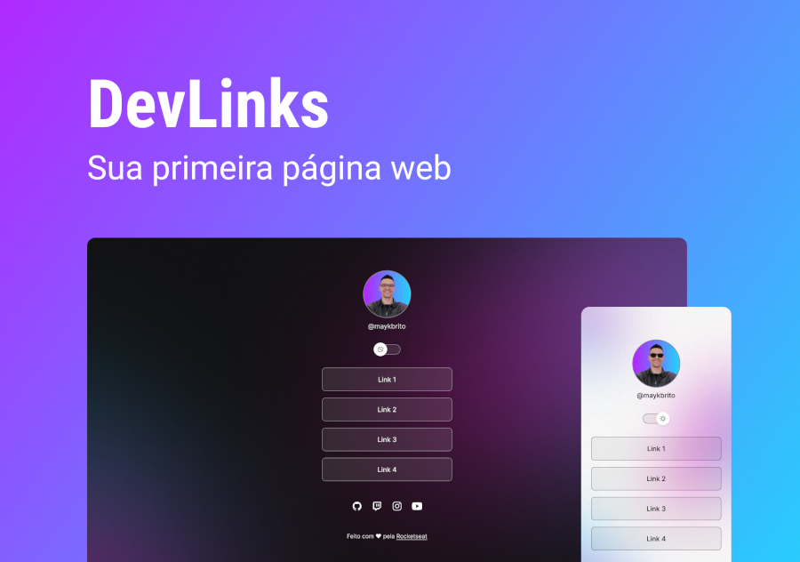

<h1 align="center"> DevLinks </h1>

DevLinks é porjeto educacional gratuito da <a href="https://lp.rocketseat;com.br/devlinks/inscricao">Rocketseat</a>, para quem está iniciando no mundo da programação web. Este foi meu projeto  ao concluir este programa, fiz de forma mais avançada, tentando usar máximo de JavaScript que pode.

  <a href="#-tecnologias">Tecnologias</a>&nbsp;&nbsp;&nbsp;|&nbsp;&nbsp;&nbsp;
  <a href="#-projeto">Projeto</a>&nbsp;&nbsp;&nbsp;|&nbsp;&nbsp;&nbsp;
  <a href="#-layout">Layout</a>&nbsp;&nbsp;&nbsp;|&nbsp;&nbsp;&nbsp;
  <a href="#memo-licença">Licença</a>

  

 

## 🚀 Tecnologias

Esse projeto foi desenvolvido com as seguintes tecnologias:

- HTML e CSS
- JavaScript
- Git e Github
- Figma

## 💻 Projeto

O DevLinks é uma espécie de cartão de visita digital.

- [Visite o projeto online](https://micaelapinheirods.github.io/DevLink)

## 🔖 Layout

Você pode visualizar o layout do projeto através [DESSE LINK](https://www.figma.com/community/file/1187422022288947321). É necessário ter conta no [Figma](https://figma.com) para acessá-lo.

## :memo: Licença

Esse projeto está sob a licença MIT.

---

Feito com ♥ by Micaela Pinheiro como ajuda da Rocketseat :wave:
[Participe da nossa comunidade!](https://discord.gg/rocketseat)
